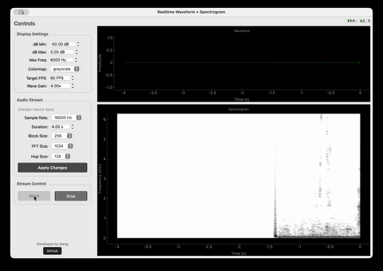

# Realtime Waveform + Spectrogram



Real-time audio visualization: waveform and spectrogram with configurable display and stream settings (sample rate, FFT, colormap, dB range, etc.).

## Download

Pre-built standalone executables are available for all platforms:

| Platform | Download |
|----------|----------|
| macOS | [rt-waveform-spectrogram-macos.zip](https://github.com/phoneticscience/rt-waveform-spectrogram/releases/latest/download/rt-waveform-spectrogram-macos.zip) |
| Windows | [rt-waveform-spectrogram-windows.zip](https://github.com/phoneticscience/rt-waveform-spectrogram/releases/latest/download/rt-waveform-spectrogram-windows.zip) |
| Linux | [rt-waveform-spectrogram-linux.tar.gz](https://github.com/phoneticscience/rt-waveform-spectrogram/releases/latest/download/rt-waveform-spectrogram-linux.tar.gz) |

Or browse all releases: [Releases](https://github.com/phoneticscience/rt-waveform-spectrogram/releases)

### Installation

**macOS:**
1. Download and unzip `rt-waveform-spectrogram-macos.zip`
2. Move `rt-waveform-spectrogram.app` to Applications (optional)
3. **First launch:** Right-click (or Control-click) the app → select "Open" → click "Open" in the dialog
   - This is required because the app is not notarized with Apple. You only need to do this once.

**Windows:**
1. Download and unzip `rt-waveform-spectrogram-windows.zip`
2. Run `rt-waveform-spectrogram.exe`

**Linux:**
1. Download and extract `rt-waveform-spectrogram-linux.tar.gz`
2. Run `./rt-waveform-spectrogram/rt-waveform-spectrogram`

## Run from Source

```bash
# from project root (Python 3.14+)
uv sync   # or: pip install -r requirements.txt
python src/rt_wav_sgram.py
```

## Build from Source

```bash
# Install build dependencies
pip install pyinstaller

# Build for current platform
python scripts/build.py
```

The built application will be in the `dist/` directory.

---
- 2026-02-13 jkang & claude first created